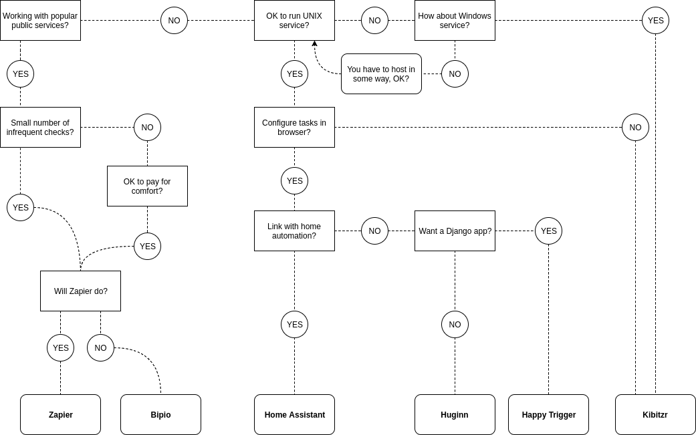

# Guide to Web Automation

## Disclaimer

I'm an enthusiast and not a professional user of all mentioned products, feel free to send corrections to [GitHub repository](https://github.com/peterdemin/web-automation-2017) or .

## Purpose

This document covers existing web automation projects, services, and platforms.

It's targeted to people who just started automating or want to switch from bunch shell scripts to a more solid foundation.

## Overview

[]

Simple web automation scripts can be written in bash or python.
However, this approach fails short in the face of network failures, different ways of delivering notifications and need to transform data.

A number of solutions try to remove boilerplate from web automation tasks.
These solutions provide:

* A foundation for making network requests and connecting them to actions.
* Collection of recipes for solving common problems built on top of the foundation.

The common examples of web automation tasks include:

* Fetching weather prediction
* Aggregating digest of social network updates
* Building complex reminders
* Keeping tabs on online resources
* Development automation

In 2011 [Zapier](https://zapier.com) launched on [Startup Weekend](http://startupweekend.org/).
It was the first solution of a kind.
Two years later a number of open source alternatives emerged, most notably:

* [Huginn](https://github.com/huginn/huginn) - Multi-tenant web solution written and extendable in Ruby.
* [Trigger-Happy](https://trigger-happy.eu/) - Similar solution, but with much fewer recipes and written as a reusable Django application.

Other services implemented web automation as a service with slightly different targeting:

* [If This Then That](https://ifttt.com) - targeted on IoT and mobile devices.
* [Bip.io](https://bip.io) - both open source and paid hosted solutions.

Projects that don't follow SaaS way:

* [Home Assistant](https://home-assistant.io/) - Platform for home automation with web automation capabilities.
* [Kibitzr](https://kibitzr.github.io) - Command-line utility extendable with Python and Bash scripts.

## Browser automation

State of the art library for browser automation is [Selenium](selenium-python.readthedocs.io).
It supports most popular platforms and browsers.
However it's primary use case is web applications testing, it's tedious in configuration and has a high entry barrier.

Browser automation complexity is an effect of following inherent properties of the task:

* Interactions must be defined in terms of markup, which is rarely composed with this thought.
* HTML structure is rigid and changes often.
* Browsers communicate through network inheriting all its failures and unreliability.

But in many cases, it's the only option to extract content from the remote system.
Number of paid solutions exists aiming to simplify web scraping:

* [Import.io](https://import.io) - turns websites into structured APIs.
* [Portia](https://scrapinghub.com/portia/) - lets you scrape web sites without any programming knowledge required.
* [Kimono](https://www.kimonolabs.com/) - manual tools for web page extraction.

Libraries for parsing and scraping web pages:

* [BeautifulSoup](https://www.crummy.com/software/BeautifulSoup/) parses malformed HTML.
* [Scrapy](https://scrapy.org/) - fast and powerful scraping and web crawling framework.

## Zapier

[Zapier](https://zapier.com) is the most popular web automation app.
Zapier tasks are called Zaps.

A Zap is a blueprint for a task you want to do over and over.
In words, a Zap looks like this: "When I get a new thing in A, do this other thing in B."
The first part is the Trigger and the second part is the Action.

Zapier supports hundreds of apps.
You can mix and match triggers and actions to automate just about anything.

An example might be "When I get a new entry from a Wufoo form, create a new lead in Salesforce."
Zapier thrives for granularity.
The user can pick what fields from the trigger service should go to the action service.
For instance, the phone number from Wufoo form should be the work phone of the new Salesforce lead.

## Huginn

[Huginn](https://github.com/huginn/huginn) is the closest alternative to Zapier.
It's a multi-tenant system for building agents that perform automated online tasks.

Huginn started in 2013 and have built a broad community with hundreds of contributors.

Huginn organizes directed graphs of events passing between different types of agents.
There are more than 50 types of agents.
The user builds pipelines of predefined agent types inside the browser.

Agents are written in Ruby language and are stored inside Huginn subdirectory.

For operating Huginn requires MySQL or PostgreSQL database and Nginx server.
Installation is pretty involved, but well documented.
Also, the project maintains Docker image, that simplifies installation a lot.

## Trigger Happy

[Trigger-Happy](https://trigger-happy.eu/) is similar to Huginn in design but is implemented as a reusable Django application.
The community is smaller, and the project doesn't see much attention these days.
With 900 stars on GitHub, 1000 triggers configured by 200 users on website, project lives its life slowly but surely.

## IFTTT

[IFTTT](https://ifttt.com) takes the idea of web automation and pushes it forward to wearables and smart home appliances. IFTTT provides applets, that can be installed on a mobile device and hooked up to the platform.

## Bipio

[Bipio](https://bip.io) approaches web automation from a slightly different angle. Instead of providing API wrappers for popular online services, like Zapier, it bases on web hooks organized in graph pipelines.

Bipio is a graph pipelining API talking RESTful JSON, where each node in your graph is responsible for performing a discrete unit of work, such a transforming messages, integrating "cloud" API or many other types of web-based RPC's. 

This is a JSON API supporting REST and RPC endpoints over HTTP Basic Authenticated SSL. See endpoints for further connection info. JSONP is enabled by setting the ?callback=my_function query parameter. 

The graph structures, 'bips', transform content between adjacent nodes. They can be reconfigured dynamically without requiring changes to the connecting client, ideal for rapid prototyping or any kind of inter protocol communication. 

Bips are configured by defining a graph (hub) across nodes (channels). Channels perform a discrete unit of work and emit a predictable result, so as to be arranged on a bip's hub in meaningful ways. Collections of similar Channels reside in shared resource containers called Pods.

## Home Assistant

[Home Assistant](https://home-assistant.io/) is an open source home automation platform.
It is capable of tracking, controlling and automating lights, media players and other "smart" devices at home.
Home Assistant can deployed on any machine that runs Python 3 - from a Raspberry Pi to a NAS device.
It integrates with a number of open-source as well as commercial offerings like IFTTT, weather information, Amazon Echo.
There are sensors for RESTful services and advanced HTTP handlers, that make the product a good fit for web automation needs.

## Kibitzr

[Kibitzr](https://kibitzr.github.io) outstands from the list in architecture.
It doesn't provide user interface and doesn't require database to run.
Kibitzr serves list of checks.
Checks are defined in single YAML file.
Each check is a pipeline of following steps:

1. Fetch page;
2. Pass it’s contents through sequence of transforms;
3. Run set of notifiers with transformed content.

Each step can contain arbitrary Bash or Python code snippets.

Like Home Assistant, it can be launched whenever Python is available (Version 2 as well as 3).

Being a late to the party, Kibitzr doesn't try to have all possible integrations built-in.
Instead, it can be hooked to Zapier, or any other web automation provider for missing parts.

Another strong aspect of Kibitzr is support for browser automation through Selenium scripts or simplified form filling (which covers most use cases).

## How to choose the right solution?

There is no silver bullet, and each solution has it's pros and cons.

Try this flowchart

