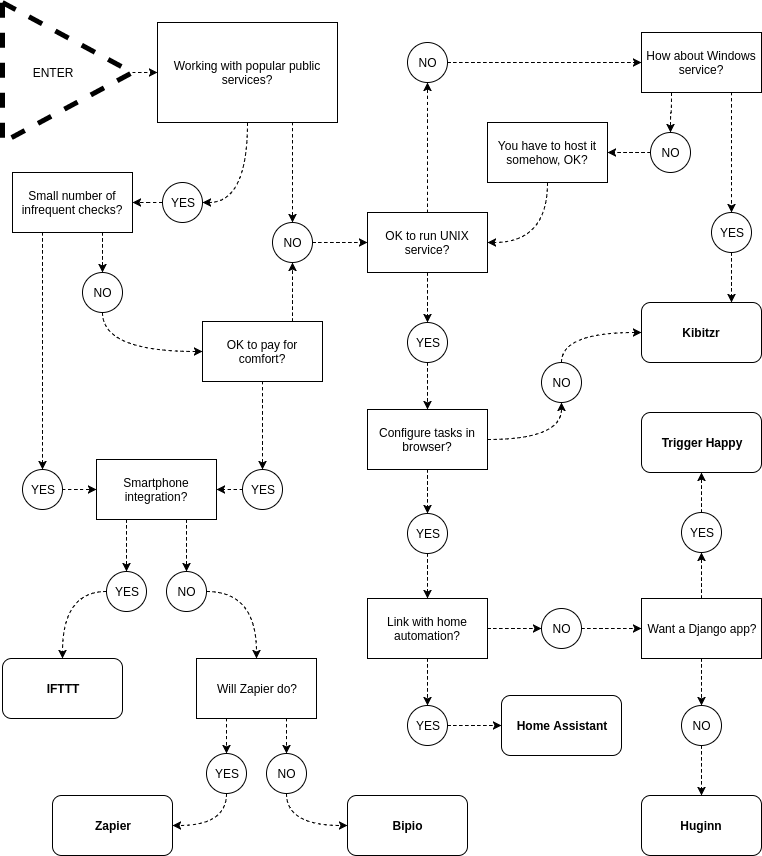

# Guide to Web Automation

## Disclaimer

I'm an enthusiast and not a professional user of all mentioned products, feel free to send corrections to
[GitHub repository](https://github.com/peterdemin/web-automation-2017) or
.

# Introduction

This article covers existing web automation projects, services, and platforms.
It targets people who are starting automation or want to switch from a bunch of shell scripts to a more solid foundation.

Web automation replaces human with software for repetitive and tedious tasks, such as:

* Form filling
* Screen scraping
* Data extraction and transfer between applications
* Website testing
* Periodical report generation
 
Small businesses, as well as huge enterprises, benefit from web automation solutions.
Here are a few examples of what companies do.

When a client relations management system registers a new customer, create a new queue in ticket tracker.
For every service, that customer requested inside CRM, create a new ticket in an appropriate queue.
Web automation combines two focused products to deliver complete customer satisfaction workflow.

Another example. Typeform provides a stunning interface for complex forms submission.
But can not process collected data.
WebMerge fills Excel spreadsheets and run calculations.
But has a deterring appearance for unprepared customer.
Web automation connects data from Typeform to WebMerge spreadsheets.
Result -- instant project cost estimation.

Personal applications of web automation include:

* Notifying on weather conditions on predefined times
* Aggregating digest of social network updates
* Deployment automation in hobbyist projects
* Keeping tabs on online resources
* Building complex reminders

System administrators write simple web automation scripts in bash for a long time.
For example, crontab job that:
* runs `curl`
* filters it's output with grep
* and sends an e-mail in case of a match (or non-match).

This is a simplistic scenario, but even it has a few problems:

* Unexpected HTTP errors will have poor to no formatting in the report.
* Complex grep expressions are unmaintainable.
* Sending e-mail from bash is unreliable and requires system setup.

What if you want the notification in instant messenger or SMS?
Fitting everything inside one bash script will leave you with a messy tool.

Many solutions try to remove boilerplate from web automation tasks, by providing:

* A foundation for making network requests and connecting them to actions.
* Collection of recipes for solving common problems built on top of the foundation.

Big part of web automation is browser automation.
It aims to mimic how person uses web browser to automate repetetive scenarios.
As it usually happens with a computer trying to be a human, the process gets complex and fragile.
This complexity is an effect of following inherent properties of the task:

* Browser interactions are based on HTML markup, which is rarely composed with this thought in mind.
* HTML structure is rigid and changes often.
* Browsers communicate through network inheriting all its failures and unreliability.

But sometimes it's the only option to extract content from the remote system.
Many paid solutions, as well as free libraries, attempt to simplify web scraping.

# Products

In 2011 [Zapier](https://zapier.com) launched on [Startup Weekend](http://startupweekend.org/).
It was the first solution of a kind.
Two years later a few open source alternatives emerged:

* [Huginn](https://github.com/huginn/huginn) - Multi-tenant website written in Ruby.
* [Trigger-Happy](https://trigger-happy.eu/) - Similar solution,  written as a reusable Django application. But with much fewer recipes.

Other services implemented web automation as a service with different targeting:

* [If This Then That](https://ifttt.com) - targeted on IoT and mobile devices.
* [Bip.io](https://bip.io) - both open source and paid hosted solutions.

Projects that don't follow SaaS way:

* [Home Assistant](https://home-assistant.io/) - home automation platform with web automation capabilities.
* [Kibitzr](https://kibitzr.github.io) - Command-line utility extendable with Python and Bash scripts.

Projects attempting to automate browser automation:

* [Import.io](https://import.io) turns websites into structured APIs.
* [Portia](https://scrapinghub.com/portia/) scrapes web sites without any programming knowledge required.
* [Kimono](https://www.kimonolabs.com/) - tool for manual web page data extraction.

Open source libraries for parsing and scraping web sites:

* [Selenium](https://selenium-python.readthedocs.io) - state of the art library for browser automation.
  It supports most popular platforms and browsers.
  It's primary use case is web applications testing.
  It's tedious in configuration and has a high entry barrier.
* [BeautifulSoup](https://www.crummy.com/software/BeautifulSoup/) parses malformed HTML.
* [Scrapy](https://scrapy.org/) - fast and powerful scraping and web crawling framework.

## Zapier

[Zapier](https://zapier.com) is the most popular web automation app.
Zapier runs Zaps.
A Zap is a blueprint for a task you want to do over and over.
In words, a Zap looks like this: "When I get a new thing in A, do this other thing in B."
The first part is the Trigger and the second part is the Action.

Zapier supports hundreds of apps.
You can mix and match triggers and actions to automate just about anything.

An example might be "When I get a new entry from a Wufoo form, create a new lead in Salesforce."
Zapier thrives for granularity.
The user can pick what fields from the trigger service should go to the action service.
For instance, the phone number from Wufoo form should be the work phone of the new Salesforce lead.

## Huginn

[Huginn](https://github.com/huginn/huginn) is the closest free alternative to Zapier.
It's a multi-tenant system for building agents that perform automated online tasks.

Huginn started in 2013. It has built a broad community with hundreds of contributors.

Huginn organizes directed graphs of events passing between different types of agents.
There are more than 50 types of agents.
The user builds pipelines of predefined agent types inside the browser.
Huginn stores Ruby agents inside its subdirectory.

For operating Huginn requires MySQL or PostgreSQL database and Nginx server.
Installation is pretty involved, but well documented.
Also, the project maintains Docker image, that simplifies installation a lot.

## Trigger Happy

[Trigger-Happy](https://trigger-happy.eu/) is like Huginn in design.
But is a reusable Django application.
The community is smaller, and the project doesn't see much attention these days.
Project lives its life slow but sure.
It has 900 stars on GitHub and 1000 triggers configured by 200 users on the website.

## Bipio

[Bipio](https://bip.io) approaches web automation from a slightly different angle.
Instead of providing API wrappers for popular online services, like Zapier, it bases on web hooks organized in graph pipelines.

Bipio is a graph pipelining API talking RESTful JSON, where each node in your graph handles a discrete unit of work.
Such as transforming messages, integrating "cloud" API or many other types of web-based RPC's.

User configures bips by defining a graph (hub) across nodes (channels).
Channels perform a discrete unit of work and emit a predictable result.
Collections of similar Channels live in shared resource containers called Pods.

## IFTTT

[IFTTT](https://ifttt.com) pushes the idea of web automation to wearables and smart home appliances.
IFTTT provides applets for mobile devices that hook to the platform.

## Home Assistant

[Home Assistant](https://home-assistant.io/) is an open source home automation platform.
It is capable of tracking, controlling and automating lights, media players and other "smart" devices at home.
Home Assistant can deployed on any machine that runs Python 3 - from a Raspberry Pi to a NAS device.
It integrates with many open-source and commercial offerings like IFTTT and Amazon Echo.
Sensors for RESTful services and advanced HTTP handlers fit web automation needs.

## Kibitzr

[Kibitzr](https://kibitzr.github.io) serves a list of checks defined in a single YAML file.
Each check is a pipeline of following steps:

1. Fetch content;
2. Pass it through sequence of transforms;
3. Run set of notifiers.

Each step can contain arbitrary Bash or Python code snippets.

Kibitzr runs wherever Python is available (Version 2 as well as 3).
It has no user interface and doesn't need a database.

Being late to the party, Kibitzr doesn't try to have all possible integrations built-in.
Instead, it hooks to other web automation providers for missing parts.

It has first-class support for browser automation.

# How to choose the right solution?

There is no silver bullet, and each solution has its pros and cons.

Try this diagram

# See also

[Awesome-Selfhosted](https://github.com/Kickball/awesome-selfhosted#automation) has a section on automation.
